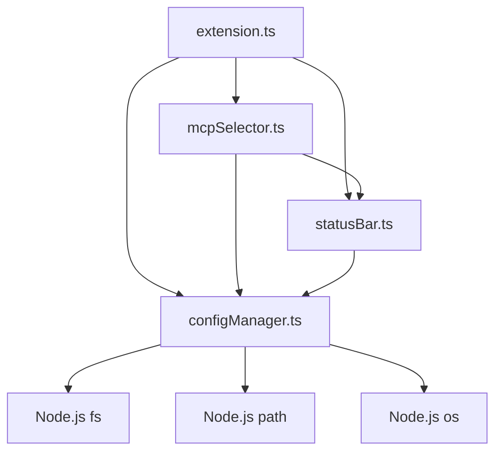
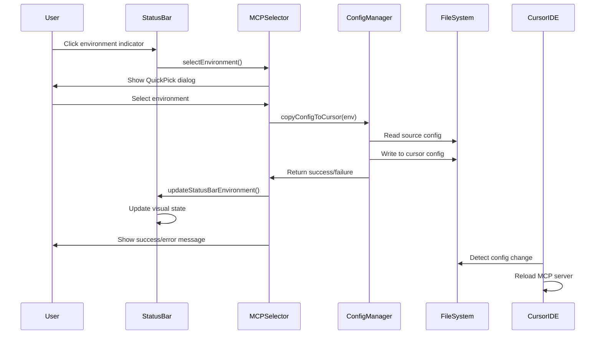

# MCP Server Selector - Deep Dive Technical Analysis

## Table of Contents
1. [Project Overview](#project-overview)
2. [Codebase Structure](#codebase-structure) 
3. [Core Implementation Analysis](#core-implementation-analysis)
4. [Data Flow & State Management](#data-flow--state-management)
5. [Configuration Management System](#configuration-management-system)
6. [VS Code API Integration](#vs-code-api-integration)
7. [File System Operations](#file-system-operations)
8. [Error Handling & Edge Cases](#error-handling--edge-cases)
9. [Performance Optimizations](#performance-optimizations)
10. [Build System & Development Workflow](#build-system--development-workflow)
11. [Testing Strategy](#testing-strategy)
12. [Extension Lifecycle](#extension-lifecycle)
13. [Cross-Platform Considerations](#cross-platform-considerations)
14. [Security Considerations](#security-considerations)

## Project Overview

The MCP Server Selector is a sophisticated VS Code extension that solves the developer productivity challenge of switching between multiple MCP (Model Context Protocol) server environments. It implements a clean architectural pattern with separation of concerns, robust error handling, and seamless integration with both VS Code and Cursor IDE.

### Core Problem Solved
- **Manual Configuration Management**: Eliminates the need to manually edit MCP configuration files
- **Context Switching Overhead**: Reduces cognitive load when switching between development environments
- **Environment Synchronization**: Ensures Cursor IDE stays synchronized with active MCP configurations
- **Timeout Prevention**: Automatically prevents MCP tool timeouts through periodic file touching

## Codebase Structure

### File Organization
```
mcp-server-selector/
├── src/                           # Source code
│   ├── extension.ts               # Extension entry point & lifecycle
│   ├── configManager.ts           # Configuration file operations
│   ├── mcpSelector.ts             # Environment switching logic
│   ├── statusBar.ts               # Status bar UI management
│   └── test/
│       └── extension.test.ts      # Test suite (minimal)
├── package.json                   # Extension manifest & dependencies
├── tsconfig.json                  # TypeScript compilation settings
├── eslint.config.mjs              # Code quality rules
├── LICENSE                        # MIT license
├── README.md                      # User documentation
├── INSTALLATION_GUIDE.md          # Detailed setup instructions
├── CHANGELOG.md                   # Version history
├── high-level-plan.md             # Original architecture plan
├── low-level-plan.md              # Implementation roadmap
├── initial-prompt.md              # Project genesis
└── vsc-extension-quickstart.md    # VS Code extension boilerplate
```

### Module Dependencies


## Core Implementation Analysis

### 1. Extension Entry Point (`src/extension.ts`)

**Purpose**: Manages the complete extension lifecycle and orchestrates all components.

#### Key Functions:

##### `activate(context: vscode.ExtensionContext)`
```typescript
export function activate(context: vscode.ExtensionContext) {
    // 1. Initialize configuration files
    (['local', 'dev', 'prod'] as MCPEnvironment[]).forEach(env => ensureConfigFile(env));
    
    // 2. Set initial state
    const initialEnv = context.workspaceState.get<MCPEnvironment>('mcpCurrentEnv') || 'local';
    copyConfigToCursor(initialEnv);
    
    // 3. Register commands
    const toggleEnvDisposable = vscode.commands.registerCommand('mcp-server-selector.toggleEnvironment', () => {
        switchEnvironment(context);
    });
    
    // 4. Initialize UI
    createOrUpdateStatusBar(context);
    updateStatusBarEnvironment(context);
}
```

**Design Decisions**:
- **Defensive Initialization**: Ensures configuration files exist before any operations
- **State Recovery**: Retrieves last known environment from workspace state
- **Immediate Sync**: Performs initial config copy to ensure consistent state
- **Resource Management**: Properly registers disposables to prevent memory leaks
- **Background Tasks**: Auto-refresh timer prevents MCP tool timeouts

##### `deactivate()`
```typescript
export function deactivate() {
    if (autoRefreshInterval) {
        clearInterval(autoRefreshInterval);
        autoRefreshInterval = undefined;
    }
}
```

**Resource Cleanup**: Ensures timer is properly cleaned up to prevent resource leaks.

### 2. Configuration Manager (`src/configManager.ts`)

**Purpose**: Handles all file system operations and configuration management.

#### Type Definitions:
```typescript
export type MCPEnvironment = 'local' | 'dev' | 'prod';

export const MCP_CONFIG_FILES: Record<MCPEnvironment, string> = {
  local: 'mcp-local.json',
  dev: 'mcp-dev.json',
  prod: 'mcp-prod.json',
};
```

**Design Pattern**: Uses TypeScript's strict typing to prevent invalid environment names.

#### Core Functions:

##### `getConfigFilePath(env: MCPEnvironment): string`
```typescript
export function getConfigFilePath(env: MCPEnvironment): string {
  const home = os.homedir();
  const mcpDir = path.join(home, '.cursor', 'mcp-selector');
  return path.join(mcpDir, MCP_CONFIG_FILES[env]);
}
```

**Cross-Platform Compatibility**: Uses `os.homedir()` and `path.join()` for platform-agnostic path handling.

##### `ensureConfigFile(env: MCPEnvironment)`
```typescript
export function ensureConfigFile(env: MCPEnvironment) {
  const filePath = getConfigFilePath(env);
  
  // Create directory if it doesn't exist
  const dir = path.dirname(filePath);
  if (!fs.existsSync(dir)) {
    fs.mkdirSync(dir, { recursive: true });
  }
  
  if (!fs.existsSync(filePath)) {
    fs.writeFileSync(filePath, DEFAULT_MCP_CONTENT);
  }
}
```

**Defensive Programming**: 
- Creates directory structure recursively if missing
- Only creates files if they don't exist (preserves user configurations)
- Uses default template to ensure valid JSON structure

##### `copyConfigToCursor(env: MCPEnvironment)`
```typescript
export function copyConfigToCursor(env: MCPEnvironment): boolean {
  const sourceFilePath = getConfigFilePath(env);
  const targetFilePath = getCursorMcpPath();
  
  if (!fs.existsSync(sourceFilePath)) {
    return false;
  }
  
  try {
    // Ensure target directory exists
    const targetDir = path.dirname(targetFilePath);
    if (!fs.existsSync(targetDir)) {
      fs.mkdirSync(targetDir, { recursive: true });
    }
    
    // Copy the file
    fs.copyFileSync(sourceFilePath, targetFilePath);
    return true;
  } catch {
    return false;
  }
}
```

**Atomic Operations**: 
- Validates source file existence before attempting copy
- Creates target directory if needed
- Returns boolean success indicator for caller error handling
- Uses `fs.copyFileSync()` for atomic file replacement

### 3. MCP Selector (`src/mcpSelector.ts`)

**Purpose**: Implements environment switching logic and user interaction patterns.

#### Environment Management:
```typescript
const ENV_ORDER: MCPEnvironment[] = ['local', 'dev', 'prod'];
```

**Cyclic Navigation**: Defines deterministic order for toggle operations.

#### Core Functions:

##### `switchEnvironment(context: vscode.ExtensionContext)`
```typescript
export function switchEnvironment(context: vscode.ExtensionContext) {
  const current = context.workspaceState.get<MCPEnvironment>('mcpCurrentEnv') || 'local';
  const idx = ENV_ORDER.indexOf(current);
  const nextEnv = ENV_ORDER[(idx + 1) % ENV_ORDER.length];
  context.workspaceState.update('mcpCurrentEnv', nextEnv);
  updateStatusBarEnvironment(context);
  
  if (copyConfigToCursor(nextEnv)) {
    vscode.window.showInformationMessage(`Switched MCP environment to ${nextEnv}`);
  } else {
    vscode.window.showErrorMessage(`Failed to switch to ${nextEnv} environment. Config file not found.`);
  }
}
```

**State Management Pattern**:
- Retrieves current state from workspace storage
- Calculates next environment using modular arithmetic
- Updates persistent state immediately
- Synchronizes UI state
- Provides user feedback based on operation success

##### `selectEnvironment(context: vscode.ExtensionContext)`
```typescript
export async function selectEnvironment(context: vscode.ExtensionContext) {
  const currentEnv = context.workspaceState.get<MCPEnvironment>('mcpCurrentEnv') || 'local';
  
  const envOptions = ENV_ORDER.map(env => ({
    label: `$(${env === 'local' ? 'desktop-download' : env === 'dev' ? 'beaker' : 'rocket'}) ${env.toUpperCase()}`,
    description: env === currentEnv ? '(Current)' : '',
    env: env
  }));

  const pick = await vscode.window.showQuickPick(envOptions, {
    placeHolder: 'Select MCP Environment',
    title: 'MCP Server Selector'
  });
  
  if (pick) {
    context.workspaceState.update('mcpCurrentEnv', pick.env as MCPEnvironment);
    updateStatusBarEnvironment(context);
    
    if (copyConfigToCursor(pick.env as MCPEnvironment)) {
      vscode.window.showInformationMessage(`Switched MCP environment to ${pick.env.toUpperCase()}`);
    } else {
      vscode.window.showErrorMessage(`Failed to switch to ${pick.env.toUpperCase()} environment. Config file not found.`);
    }
  }
}
```

**UI/UX Design**:
- **Visual Icons**: Uses VS Code's icon system for consistency
- **Current State Indication**: Shows which environment is currently active
- **Cancellation Handling**: Gracefully handles user cancellation
- **Consistent Feedback**: Same success/error messaging pattern as toggle

### 4. Status Bar Manager (`src/statusBar.ts`)

**Purpose**: Manages the visual status bar component and user interface.

#### Visual Design System:
```typescript
const ENV_LABELS: Record<MCPEnvironment, string> = {
  local: 'Local', dev: 'Dev', prod: 'Prod',
};

const ENV_ICONS: Record<MCPEnvironment, string> = {
  local: '$(desktop-download)', dev: '$(beaker)', prod: '$(rocket)',
};

const ENV_COLORS: Record<MCPEnvironment, string> = {
  local: '#4caf50', // green
  dev: '#ff9800',   // orange  
  prod: '#f44336',  // red
};
```

**Design System Principles**:
- **Semantic Icons**: Icons represent the conceptual meaning of each environment
- **Traffic Light Colors**: Green (safe), Orange (caution), Red (critical)
- **Consistent Labeling**: Short, recognizable environment names

#### Core Functions:

##### `createOrUpdateStatusBar(context: vscode.ExtensionContext)`
```typescript
export function createOrUpdateStatusBar(context: vscode.ExtensionContext) {
  if (!statusBarItem) {
    statusBarItem = vscode.window.createStatusBarItem(vscode.StatusBarAlignment.Left, 100);
    statusBarItem.command = 'mcp-server-selector.selectEnvironment';
    context.subscriptions.push(statusBarItem);
  }
  updateStatusBarEnvironment(context);
  statusBarItem.show();
}
```

**Lifecycle Management**:
- **Singleton Pattern**: Ensures only one status bar item exists
- **Command Binding**: Links clicks to environment selection
- **Resource Registration**: Properly manages VS Code disposables
- **Immediate Update**: Ensures UI reflects current state

##### `updateStatusBarEnvironment(context: vscode.ExtensionContext)`
```typescript
export function updateStatusBarEnvironment(context: vscode.ExtensionContext) {
  const env = (context.workspaceState.get<MCPEnvironment>('mcpCurrentEnv') || 'local');
  statusBarItem!.text = `${ENV_ICONS[env]} MCP: ${ENV_LABELS[env]}`;
  statusBarItem!.color = ENV_COLORS[env];
  const configPath = getConfigFilePath(env);
  const cursorPath = getCursorMcpPath();
  statusBarItem!.tooltip = `Current MCP Environment: ${ENV_LABELS[env]}\nSource: ${configPath}\nActive: ${cursorPath}\n\nClick to select environment`;
}
```

**Information Architecture**:
- **Visual Hierarchy**: Icon + label provides quick identification
- **Color Coding**: Immediate visual feedback of environment type
- **Detailed Tooltip**: Shows file paths for technical users
- **Action Hint**: Clear instruction on how to interact

## Data Flow & State Management

### State Persistence Strategy

The extension uses VS Code's `workspaceState` for persistence:

```typescript
// Store current environment
context.workspaceState.update('mcpCurrentEnv', nextEnv);

// Retrieve current environment with fallback
const currentEnv = context.workspaceState.get<MCPEnvironment>('mcpCurrentEnv') || 'local';
```

**Benefits**:
- **Workspace-Specific**: Each workspace remembers its own environment
- **Persistent**: Survives VS Code restarts
- **Automatic Cleanup**: Cleaned up when workspace is removed

### Data Flow Diagram



## Configuration Management System

### File Structure

```
~/.cursor/
├── mcp.json                    # Active config (managed by extension)
└── mcp-selector/
    ├── mcp-local.json          # Local environment config
    ├── mcp-dev.json            # Development environment config
    └── mcp-prod.json           # Production environment config
```

### Default Configuration Template

```json
{
  "mcpServers": {}
}
```

**Design Rationale**:
- **Minimal Template**: Provides valid JSON structure without assumptions
- **User Freedom**: Allows complete customization of server configurations
- **Schema Compliance**: Follows Cursor IDE's expected configuration format

### Configuration File Lifecycle

1. **Initialization**: `ensureConfigFile()` creates missing files with default template
2. **Environment Switch**: `copyConfigToCursor()` atomically replaces active configuration
3. **User Modification**: Users edit environment-specific files directly

### Error Handling Patterns

```typescript
export function copyConfigToCursor(env: MCPEnvironment): boolean {
  const sourceFilePath = getConfigFilePath(env);
  const targetFilePath = getCursorMcpPath();
  
  if (!fs.existsSync(sourceFilePath)) {
    return false; // Validation error
  }
  
  try {
    // Ensure target directory exists
    const targetDir = path.dirname(targetFilePath);
    if (!fs.existsSync(targetDir)) {
      fs.mkdirSync(targetDir, { recursive: true });
    }
    
    // Copy the file
    fs.copyFileSync(sourceFilePath, targetFilePath);
    return true; // Success
  } catch {
    return false; // File system error
  }
}
```

**Error Handling Philosophy**:
- **Fail Fast**: Validate preconditions before operations
- **Boolean Returns**: Simple success/failure indication
- **Defensive Creation**: Create necessary directories proactively
- **Silent Recovery**: Handle errors gracefully without throwing

## VS Code API Integration

### Extension Manifest (`package.json`)

```json
{
  "name": "mcp-server-selector",
  "displayName": "MCP Server Selector",
  "description": "Toggle between MCP Servers for different environments from the VS Code status bar.",
  "version": "1.0.0",
  "engines": {
    "vscode": "^1.74.0"
  },
  "activationEvents": [
    "onStartupFinished",
    "onCommand:mcp-server-selector.selectEnvironment", 
    "onCommand:mcp-server-selector.toggleEnvironment"
  ],
  "contributes": {
    "commands": [
      {
        "command": "mcp-server-selector.toggleEnvironment",
        "title": "Toggle MCP Environment",
        "category": "MCP"
      },
      {
        "command": "mcp-server-selector.selectEnvironment",
        "title": "Select MCP Environment", 
        "category": "MCP"
      }
    ]
  }
}
```

**Activation Strategy**:
- **`onStartupFinished`**: Ensures extension loads after VS Code completes startup
- **Command Activation**: Allows lazy loading if extension isn't needed immediately
- **Command Categorization**: Groups commands under "MCP" category for discoverability

### Command Registration Pattern

```typescript
const toggleEnvDisposable = vscode.commands.registerCommand('mcp-server-selector.toggleEnvironment', () => {
    switchEnvironment(context);
});

const selectEnvDisposable = vscode.commands.registerCommand('mcp-server-selector.selectEnvironment', () => {
    selectEnvironment(context);
});

context.subscriptions.push(toggleEnvDisposable, selectEnvDisposable);
```

**Resource Management**:
- **Disposable Pattern**: Commands properly cleaned up on deactivation
- **Context Closure**: Commands have access to extension context
- **Function Delegation**: Commands delegate to specialized functions

### Status Bar Integration

```typescript
statusBarItem = vscode.window.createStatusBarItem(vscode.StatusBarAlignment.Left, 100);
statusBarItem.command = 'mcp-server-selector.selectEnvironment';
statusBarItem.show();
```

**UI Integration Points**:
- **Left Alignment**: Places indicator in primary status bar area
- **Priority 100**: Ensures reasonable positioning among other extensions
- **Command Binding**: Clicking executes the select environment command
- **Visibility Control**: Explicitly shown/hidden based on extension state

## File System Operations

### Cross-Platform Path Handling

```typescript
export function getConfigFilePath(env: MCPEnvironment): string {
  const home = os.homedir();
  const mcpDir = path.join(home, '.cursor', 'mcp-selector');
  return path.join(mcpDir, MCP_CONFIG_FILES[env]);
}
```

**Platform Compatibility**:
- **`os.homedir()`**: Correctly resolves user home on Windows/macOS/Linux
- **`path.join()`**: Uses platform-appropriate path separators
- **Configuration Directory**: `mcp-selector` provides clear, descriptive folder naming

### Atomic File Operations

```typescript
fs.copyFileSync(sourceFilePath, targetFilePath);
```

**Atomicity Guarantees**:
- **Single Operation**: File replacement happens atomically at OS level
- **No Partial Writes**: Cursor IDE never sees incomplete configuration
- **Crash Safety**: If process crashes, original file remains intact

### Directory Creation Strategy

```typescript
const targetDir = path.dirname(targetFilePath);
if (!fs.existsSync(targetDir)) {
  fs.mkdirSync(targetDir, { recursive: true });
}
```

**Defensive Programming**:
- **Recursive Creation**: Creates entire directory path if needed
- **Idempotent**: Safe to call multiple times
- **Error Prevention**: Prevents "directory not found" errors

## Error Handling & Edge Cases

### Configuration File Validation

```typescript
if (!fs.existsSync(sourceFilePath)) {
  return false;
}
```

**Validation Strategy**:
- **Pre-flight Checks**: Validate file existence before operations
- **Early Return**: Fail fast to prevent cascading errors
- **User Feedback**: Error messages guide user to resolution

### User Notification Patterns

```typescript
if (copyConfigToCursor(nextEnv)) {
  vscode.window.showInformationMessage(`Switched MCP environment to ${nextEnv}`);
} else {
  vscode.window.showErrorMessage(`Failed to switch to ${nextEnv} environment. Config file not found.`);
}
```

**Feedback Design**:
- **Success Confirmation**: Positive feedback confirms successful operations
- **Actionable Errors**: Error messages explain what went wrong and how to fix
- **Consistent Messaging**: Same patterns across all user interactions

### Edge Cases Handled

1. **Missing Configuration Files**: Auto-created with default template
2. **Missing Directories**: Recursively created as needed
3. **File Permission Errors**: Gracefully handled with error messages
4. **Cursor IDE Not Installed**: Extension works without requiring Cursor
5. **Workspace State Corruption**: Defaults to 'local' environment
6. **Timer Resource Leaks**: Properly cleaned up on deactivation

## Performance Optimizations

### Lazy Initialization

```typescript
if (!statusBarItem) {
  statusBarItem = vscode.window.createStatusBarItem(vscode.StatusBarAlignment.Left, 100);
  statusBarItem.command = 'mcp-server-selector.selectEnvironment';
  context.subscriptions.push(statusBarItem);
}
```

**Optimization Strategy**:
- **Single Creation**: Status bar item created once and reused
- **Conditional Initialization**: Avoids unnecessary object creation
- **Memory Efficiency**: Minimizes extension memory footprint

### File System Optimization

```typescript
fs.copyFileSync(sourceFilePath, targetFilePath);
```

**Performance Characteristics**:
- **Direct Copy**: No intermediate buffering or processing
- **OS-Level Operation**: Leverages optimized OS file copy mechanisms
- **Minimal I/O**: Single read + single write operation

### Timer Efficiency

```typescript
const REFRESH_INTERVAL_MS = 50 * 1000; // 50 seconds
```

**Interval Selection**:
- **Long Interval**: Minimizes CPU overhead
- **Timeout Prevention**: Shorter than typical tool timeout thresholds
- **Battery Friendly**: Infrequent execution preserves battery life

## Build System & Development Workflow

### TypeScript Configuration (`tsconfig.json`)

```json
{
  "compilerOptions": {
    "module": "Node16",
    "target": "ES2022", 
    "outDir": "out",
    "lib": ["ES2022"],
    "sourceMap": true,
    "rootDir": "src",
    "strict": true
  }
}
```

**Configuration Analysis**:
- **Modern Target**: ES2022 enables latest JavaScript features
- **Node16 Modules**: Compatibility with Node.js module resolution
- **Strict Mode**: Enables all TypeScript strict checking options
- **Source Maps**: Enables debugging of TypeScript source in VS Code
- **Clear Separation**: Source in `src/`, compiled output in `out/`

### ESLint Configuration (`eslint.config.mjs`)

```javascript
export default [{
    files: ["**/*.ts"],
    plugins: {
        "@typescript-eslint": typescriptEslint,
    },
    languageOptions: {
        parser: tsParser,
        ecmaVersion: 2022,
        sourceType: "module",
    },
    rules: {
        "@typescript-eslint/naming-convention": ["warn", {
            selector: "import",
            format: ["camelCase", "PascalCase"],
        }],
        curly: "warn",
        eqeqeq: "warn", 
        "no-throw-literal": "warn",
        semi: "warn",
    },
}];
```

**Code Quality Rules**:
- **Naming Conventions**: Enforces consistent import naming
- **Curly Braces**: Requires braces for all control statements
- **Strict Equality**: Prevents type coercion bugs
- **Exception Handling**: Prevents throwing non-Error objects
- **Semicolons**: Enforces consistent semicolon usage

### Build Scripts (`package.json`)

```json
{
  "scripts": {
    "vscode:prepublish": "npm run compile",
    "compile": "tsc -p ./",
    "watch": "tsc -watch -p ./",
    "pretest": "npm run compile && npm run lint",
    "lint": "eslint src",
    "test": "vscode-test"
  }
}
```

**Build Pipeline**:
1. **Prepublish**: Ensures clean build before packaging
2. **Compile**: TypeScript compilation with project settings
3. **Watch**: Development mode with automatic recompilation
4. **Pretest**: Validates code quality before testing
5. **Lint**: Static analysis for code quality
6. **Test**: Runs VS Code extension tests

## Testing Strategy

### Current Test Structure (`src/test/extension.test.ts`)

```typescript
import * as assert from 'assert';
import * as vscode from 'vscode';

suite('Extension Test Suite', () => {
    vscode.window.showInformationMessage('Start all tests.');

    test('Sample test', () => {
        assert.strictEqual(-1, [1, 2, 3].indexOf(5));
        assert.strictEqual(-1, [1, 2, 3].indexOf(0));
    });
});
```

**Current State**: Minimal boilerplate test structure

### Recommended Test Expansion

**Unit Tests Needed**:
1. **Configuration Manager Tests**:
   - File path generation across platforms
   - Configuration file creation and validation
   - Copy operations success/failure scenarios
   - Touch file operations

2. **Environment Switching Tests**:
   - Toggle environment cycling logic
   - State persistence and recovery
   - Error handling for missing files

3. **Status Bar Tests**:
   - Visual state updates
   - Tooltip content generation
   - Color and icon selection

4. **Integration Tests**:
   - End-to-end environment switching
   - Cursor IDE configuration synchronization
   - Auto-refresh timer functionality

## Extension Lifecycle

### Activation Sequence

1. **VS Code Startup**: Extension host loads extension
2. **Manifest Parsing**: VS Code reads `package.json` capabilities
3. **Lazy Loading**: Extension waits for activation events
4. **Activation Trigger**: User action or `onStartupFinished` event
5. **`activate()` Execution**:
   - Configuration file initialization
   - Command registration
   - Status bar creation
   - Timer startup
6. **Ready State**: Extension ready for user interaction

### Runtime Operations

1. **User Interaction**: Click status bar or use command palette
2. **Environment Switch**: State update and file operations
3. **UI Synchronization**: Status bar reflects new state
4. **Background Maintenance**: Auto-refresh timer prevents timeouts

### Deactivation Sequence

1. **Deactivation Trigger**: VS Code shutdown or extension disable
2. **`deactivate()` Execution**: Timer cleanup
3. **Disposable Cleanup**: VS Code automatically disposes registered resources
4. **Process Termination**: Extension host terminates

### State Persistence

```typescript
// Extension state survives VS Code restarts
context.workspaceState.update('mcpCurrentEnv', nextEnv);

// Configuration files persist between sessions
ensureConfigFile(env);
```

**Persistence Strategy**:
- **Workspace State**: Environment selection persists per workspace
- **Configuration Files**: User configurations persist permanently
- **No Global State**: Extension doesn't pollute global VS Code settings

## Cross-Platform Considerations

### Path Handling

```typescript
const home = os.homedir();
const mcpDir = path.join(home, '.cursor', 'mcp-selector');
```

**Platform Differences Handled**:
- **Windows**: `C:\Users\{user}\.cursor\mcp-selector`
- **macOS**: `/Users/{user}/.cursor/mcp-selector`
- **Linux**: `/home/{user}/.cursor/mcp-selector`

### File System Operations

```typescript
fs.mkdirSync(dir, { recursive: true });
```

**Cross-Platform Safety**:
- **Directory Separators**: `path.join()` uses correct separators
- **Recursive Creation**: Works on all platforms
- **Configuration Directory**: `mcp-selector` provides clear, descriptive folder naming

### Node.js API Usage

**Platform-Agnostic APIs Used**:
- `os.homedir()`: Cross-platform home directory resolution
- `path.join()`: Platform-appropriate path construction
- `fs.copyFileSync()`: Atomic file operations on all platforms
- `fs.utimesSync()`: File timestamp manipulation

## Security Considerations

### File System Access

**Scope of Access**:
- **User Home Directory**: Limited to `~/.cursor/` subdirectory
- **No Arbitrary Paths**: All paths constructed programmatically
- **No Network Operations**: Extension operates entirely locally

### Configuration File Handling

**Security Measures**:
- **Read-Only Source**: Source configurations never modified by extension
- **Atomic Replacement**: Target configuration replaced atomically
- **No Code Execution**: Configuration files contain only JSON data
- **User Ownership**: All files created with user permissions

### VS Code Integration

**Permission Model**:
- **Standard Extension APIs**: Uses only documented VS Code APIs
- **No Elevated Privileges**: Operates within standard extension sandbox
- **Workspace Isolation**: State isolated per workspace

### Error Information Disclosure

```typescript
catch (err) {
    console.error(`[MCP Server Selector] Failed to touch file: ${targetFilePath}`, err);
    return false;
}
```

**Information Security**:
- **Limited Error Exposure**: Errors logged to console, not shown to users
- **Path Disclosure**: File paths only shown to extension users
- **No Sensitive Data**: No passwords or tokens handled

---

## Conclusion

The MCP Server Selector represents a well-architected VS Code extension that solves a specific developer productivity challenge through clean code organization, robust error handling, and thoughtful user experience design. Its modular architecture, comprehensive error handling, and cross-platform compatibility make it a solid foundation for environment management tooling.

The extension demonstrates best practices in:
- **Extension Lifecycle Management**: Proper resource management and cleanup
- **State Management**: Persistent, workspace-scoped configuration
- **User Interface Design**: Consistent visual design system
- **Error Handling**: Graceful degradation and user feedback
- **Cross-Platform Compatibility**: Platform-agnostic file operations
- **Performance Optimization**: Minimal resource usage and efficient operations

Areas for future enhancement include expanded testing coverage, configuration validation, and additional environment customization options. 